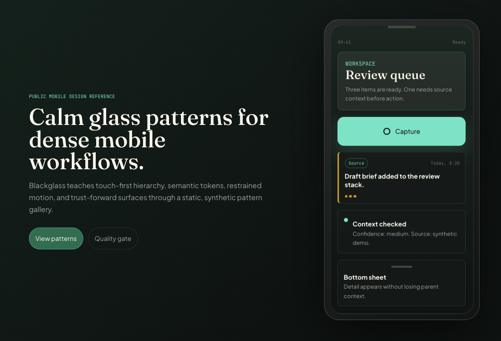
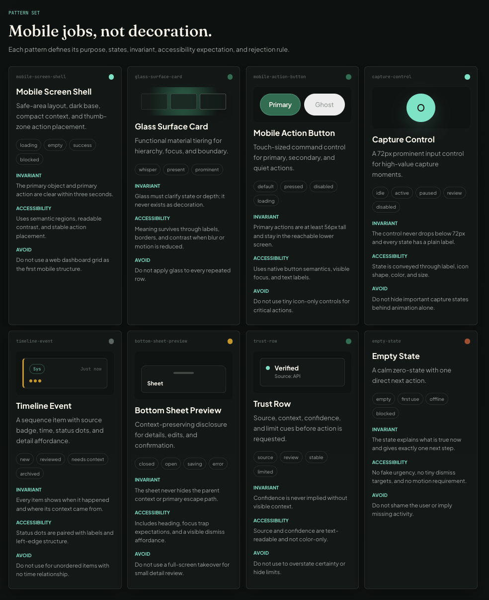

# Blackglass


**Black Glass** is a coded design system for calm, premium, trust-forward interfaces.

It turns dense context into clear, tactile, high-craft surfaces with disciplined functional liquid glass, semantic tokens, restrained motion, and visible trust.

The name is Black Glass.

The interactive pattern gallery demonstrates the system in code. One application is our mobile site; the language and principles are general.

[**View the Interactive Pattern Gallery**](https://blackglass-three.vercel.app/)

## Preview





It is not a production app, backend, account system, analytics layer, or packaged component library. It is a compact coded reference for builders and AI design tools who want interfaces that feel deliberate instead of generated, generic, or overdecorated.

## Why Blackglass?

Most design systems ask, "How do we make UI consistent?" Blackglass asks, "How do we make complex workflows feel calm, premium, tactile, and trustworthy?" By encoding taste into strict rules—glass that only appears to clarify state, targets that are always sized for intent, and semantic colors that never act alone—Blackglass helps teams and tools build interfaces that look like intentional instruments rather than generated dashboards.

## What This Teaches

- Clear screen structure with hierarchy and primary actions placed for intent.
- Functional liquid glass tiers: `whisper`, `present`, and `prominent`.
- Semantic tokens for color, spacing, radius, elevation, motion, tap targets, typography, and breakpoints.
- Trust-forward interface patterns for source, context, confidence, and boundary states.
- Intent-sized controls with clear state models.
- Anti-slop review rules for high-craft, AI-assisted builds.

## Black Glass + Claude Design 2.0

Import this repo into Claude Design 2.0 (or load it as your design).

Claude receives the complete Black Glass language:

- Tokens implemented in CSS (see TOKENS.md and site/src/styles.css)
- Coded pattern examples (gallery source in site/src)
- Enforceable rules and contracts (ANTI_SLOP.md, LIQUID_GLASS.md, Core Rules below, pattern definitions)
- Quality gates and rejection criteria

Example prompt:
"Generate this in Black Glass using the design system from this repo. Follow the tokens exactly. Use functional glass only when it clarifies hierarchy, focus, boundary or state. Make trust and context visible. No decorative effects."

## Local Preview

```bash
cd site
npm install
npm run dev
npm run build
npm run preview
```

The gallery is static. It has no backend, account flow, tracking script, or live integration.

## Pattern Set

| Pattern | Job |
|---|---|
| Screen Shell | Dark base, content rhythm, and primary action placement |
| Glass Surface Card | Functional material tiers without decorative blur |
| Action Button | Primary, secondary, ghost, disabled, and loading states |
| Capture Control | Prominent control for high-value input moments |
| Timeline Event | Sequence, source badge, timestamp, status dots, and detail affordance |
| Bottom Sheet Preview | Disclosure without losing screen context |
| Trust Row | Source, context, confidence, and ownership cues |
| Empty State | Calm zero-state with one next action |

## Core Rules

- Tokens first. Raw colors, spacing, shadows, and timing values belong in the token catalog.
- Intent first. Controls are sized for their role and context.
- Glass must do work. Use it for hierarchy, focus, boundary, or state. Remove it when it is only decoration.
- Motion explains state. Press, reveal, save, and sheet transitions are valid. Idle shimmer, fake urgency, and celebration effects are not.
- Trust is visible structure. Show source, context, confidence, uncertainty, and limits directly in the UI.
- Demo content stays synthetic and domain-neutral.

## Repo Map

```text
README.md                 Public front door
MOBILE_DESIGN_SYSTEM.md   Detailed doctrine (principles are general; some examples reference mobile applications)
LIQUID_GLASS.md           Material rules
TIMELINE_INTERFACES.md    Sequence patterns
TRUST_SURFACES.md         Source and confidence UI
MICROINTERACTIONS.md      Motion and response rules
ANTI_SLOP.md              Quality gate and rejections
TOKENS.md                 Public token catalog
COMPONENT_PATTERNS.md     Pattern contracts
ACCESSIBILITY.md          Accessibility rules
PUBLIC_BOUNDARY.md        Publication boundary
REDACTION_REPORT.md       Public-safety cleanup proof
CHANGELOG.md              Change history
site/                     Static coded gallery (the system in code)
examples/                 Pattern notes
assets/                   Screenshot and visual slots
```

## Public Boundary

Blackglass uses public-safe language, synthetic content, and generic interface patterns. It does not include sensitive examples, live integrations, internal strategy, personal context, non-public implementation details, or copied product material.

See [PUBLIC_BOUNDARY.md](PUBLIC_BOUNDARY.md) before publishing screenshots, examples, or copy.

## License

MIT. See [LICENSE](LICENSE).
